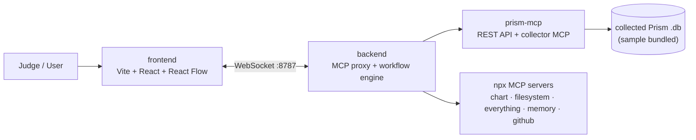

# MCP Playground

A visual playground for **building, running, and debugging multi-MCP workflows**.
Wire up [Model Context Protocol](https://modelcontextprotocol.io) servers as a
node graph, pass data between tool calls with `$ref`, set breakpoints, and watch
every step execute live over a WebSocket.

It ships with a **custom Prism MCP** (a FastAPI service + generated MCP server over
real collected Nutanix data) and a set of end-to-end examples - culminating in a
workflow that builds a charts dashboard and **publishes it to a GitHub repo + PR**,
orchestrating six MCP servers in one run.

## Architecture



- **frontend** - the canvas. Drag nodes, connect them, load an `mcp-config.json` +
  `workflow.json`, run, and step through.
- **backend** - connects to each MCP server, exposes a unified tool catalog, and
  runs the workflow DAG (dependency resolution, `$ref` data flow, breakpoints,
  cancellation). Streams engine events to the UI over `ws://localhost:8787`.
- **prism-mcp** - the custom MCP: a REST API over collected Nutanix Prism SQLite
  data, plus a FastMCP server that exposes it as tools.

## Key features

- **Visual DAG editor** for MCP tool calls (React Flow).
- **`$ref` data flow** - pipe any field of one node's result into another's args
  via JSONPath.
- **Breakpoints & step-through** - pause a run at chosen nodes and inspect
  resolved args / results before continuing.
- **Multi-MCP orchestration** - mix local `npx` servers, a remote/hosted server,
  and the custom Python MCP in a single workflow.
- **Live WebSocket debugger** - per-node `started / paused / completed / failed`
  events stream to the UI as they happen.
- **Headless CLI** - run any workflow without the UI (`list-tools`, `call-tool`,
  `run-workflow` with `--break-at`).
- **Portable Python MCP via `uv`** - no manual venvs; `uv` provisions deps on first
  launch.

## The custom Prism MCP

[`prism-mcp/`](prism-mcp/) turns collected Nutanix data into MCP tools:

1. A collected Prism database (a sample `.db` is bundled) is served by a
   **FastAPI** REST API ([`prism-mcp/rest-api/`](prism-mcp/rest-api/)) with
   Swagger at `/docs` and unit-scaled, chart-ready endpoints.
2. The Morpheus MCP generator consumes that OpenAPI spec to produce a
   **FastMCP** server ([`prism-mcp/mcp-server/`](prism-mcp/mcp-server/)) exposing
   19 tools (clusters, hosts, VMs, performance, capacity, line/pie charts).
3. The playground calls those tools to build dashboards.

## Quickstart

Prereqs: **Node.js >= 20**, **[uv](https://docs.astral.sh/uv/)**, **Python >= 3.10**.
Full commands (incl. env vars and a Windows note) are in [`cmd.txt`](cmd.txt).

```bash
# 0) one-time: bake absolute paths into the example configs
./setup.sh

# 1) Prism REST API (serves :8000, Swagger /docs, bundled sample DB)
uv run --directory prism-mcp/rest-api python rest_server.py

# 2) Backend WebSocket server (ws://localhost:8787)
cd backend && npm install && npm run dev:serve

# 3) Frontend UI (point it at the backend so it drives real MCP servers)
cd frontend && npm install && VITE_MCP_WS_URL=ws://localhost:8787 npm run dev
```

Open the UI, load an example's config + workflow, and run.

## Examples

See [`examples/README.md`](examples/README.md) for the full index. Highlights:

- **Foundations** (no creds): `hello_world`, `breakpoints_demo`, `dependson_demo`,
  `multi_layered_demo`, `everything_demo`.
- **Multi-MCP / external**: `multi_mcp_tokens_demo`, `zomato_feast_demo`,
  `github_workflow_with_mcp`, `nutanix_api_workflow_with_mcp`.
- **Custom Prism MCP**: `collector_charts_workflow_with_mcp`,
  `collector_dashboard_with_mcp`, and the headline
  `collector_dashboard_github_with_mcp` (dashboard -> GitHub repo + PR).

## Repository layout

```
mcp-playground/
├── backend/      MCP proxy + workflow engine (TypeScript; WS server on :8787; CLI)
├── frontend/     Visual playground UI (Vite + React + React Flow + Tailwind)
├── prism-mcp/    Custom Prism MCP: rest-api/ (FastAPI) + mcp-server/ (FastMCP)
├── examples/     MCP configs + workflows, grouped into self-contained demos
├── setup.sh      Bakes the repo's absolute path into example configs
├── cmd.txt       Exact run commands + environment variables
├── LICENSE       MIT
└── README.md
```

## Tech stack

- **Frontend**: Vite, React 19, `@xyflow/react` (React Flow), Tailwind CSS.
- **Backend**: Node.js (TypeScript, `tsx`), `@modelcontextprotocol/sdk`, `ws`, `zod`.
- **Custom MCP**: Python, FastAPI, Uvicorn, Pydantic, FastMCP - run with `uv`.

## Security notes

Example configs use placeholders (`*_REPLACE_WITH_YOUR_*`) for tokens and
passwords - fill them in locally and do not commit real secrets. See
`examples/README.md` for which examples need credentials.

## License

[MIT](LICENSE) (c) 2026 hardikcode-creator.
