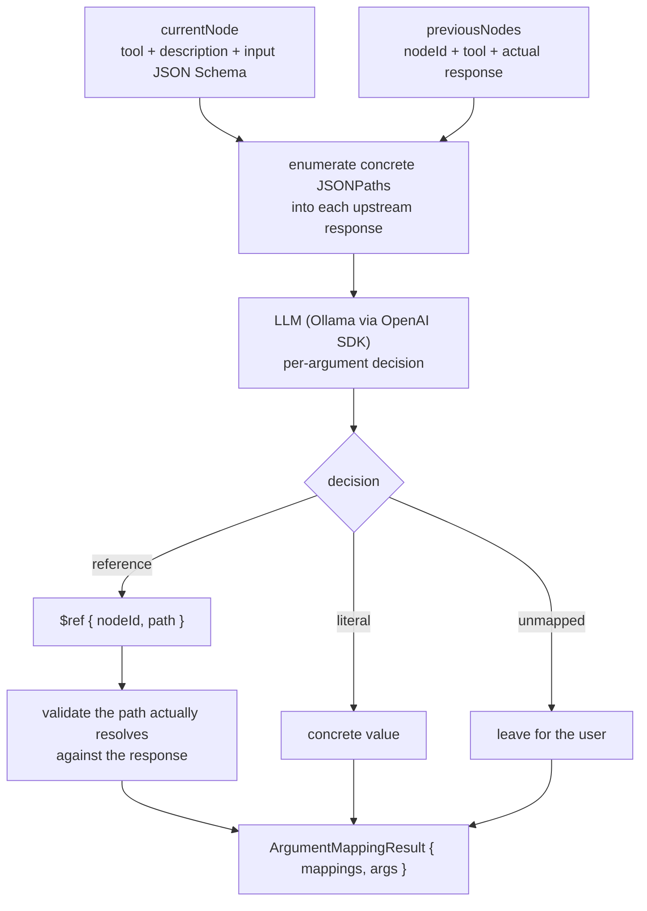

# AI Services: Smart Argument Mapping

:::caution Status: in progress
This capability lives on the feature branch
`nimish.duggal-MCP_Automapping` and is **not yet merged to `main`**. It is
documented here as designed and implemented on that branch.
:::

[Live references](./data-flow-references.mdx) already let you *pick* a path from
a response. The natural next step is to have the system **propose the whole
wiring for you**. That is what `ai-services/` does: given the node you are about
to run and the responses of its upstream nodes, it recommends which argument
should be wired to which key of which upstream result.

## How it works



The returned `args` object is **directly compatible with the backend workflow
model** - a `reference` decision becomes `{ "$ref": { "nodeId", "path" } }`,
exactly the shape the executor resolves.

## Key design choices

- **Local-first, no cloud key.** The model is a **local Ollama** instance
  accessed through its OpenAI-compatible API using the official `openai` SDK.
  Sensible Ollama defaults are built in; `OLLAMA_MODEL`, temperature, and
  reasoning effort are configurable via env.
- **Anti-hallucination guard.** Every suggested path is **validated against the
  actual response** before it is returned. Each mapping carries a `pathResolves`
  flag, so a path the model invented but that does not exist in the data is
  caught rather than silently wired in.
- **Explainable.** Each mapping includes a `decision`
  (`reference | literal | unmapped`), a `confidence`, and a one-line `reasoning`.

## Wiring into the Playground

The service runs as a small HTTP server (default `http://localhost:5174`):

- `GET /health` -> `{ "ok": true, "model": "<model>" }`
- `POST /suggest-mappings` -> body is the current node plus upstream nodes;
  response is the mapping result.

The frontend's **"Auto-map with AI"** button calls `POST /suggest-mappings` and
drops the returned `args` straight into the node. The UI points at the service
via `VITE_AI_URL`.

```bash
curl -s -X POST http://localhost:5174/suggest-mappings \
  -H 'Content-Type: application/json' \
  -d @examples/sample-mapping-input.json
# -> { "message": { "$ref": { "nodeId": "sum", "path": "$.content[0].text" } } }
```

This closes the loop on the most error-prone part of authoring a multi-MCP
workflow - wiring data between tools - and does it **privately, on the
developer's own machine.**
