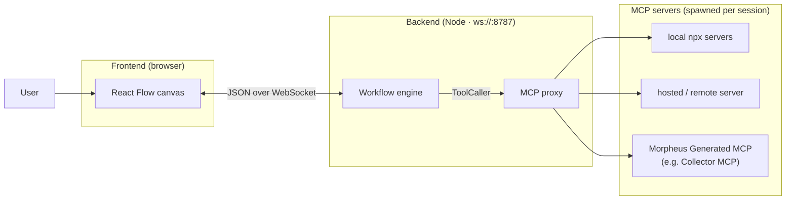
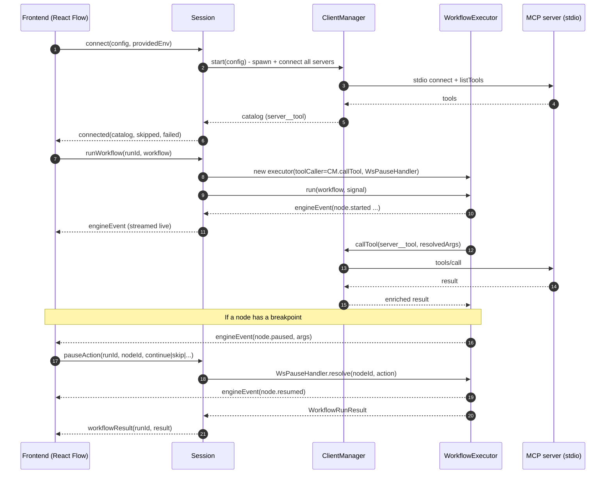

# Architecture

MCP Playground is three cooperating pieces: a **frontend** canvas, a **backend**
that is both an MCP proxy and a workflow engine, and the **MCP servers**
themselves.



## End-to-end: from a click to a tool call

Here is what happens across a full connect-and-run, including a breakpoint
round-trip:



The debugger side-channel (`pauseAction`, `cancel`, `setBreakpoint`,
`clearBreakpoint`) is processed **concurrently with a running run** - the same
`Session` handles a paused node's resume while other branches keep executing.

## What flows on the canvas: two documents

A run is defined by two JSON documents, both validated with `zod`:

1. **`mcp-config.json`** - which MCP servers to spawn. The **standard
   `mcpServers` map** is preferred (it matches Claude Desktop / Cursor /
   `mcp-remote`), and a legacy `servers` array is also accepted. Each entry is a
   spawn spec: `command`, `args`, optional `env`, optional `cwd`.

   ```json
   {
     "mcpServers": {
       "filesystem": {
         "command": "npx",
         "args": ["-y", "@modelcontextprotocol/server-filesystem", "/tmp"]
       }
     }
   }
   ```

2. **`workflow.json`** - the DAG. A workflow has an `id`, `version: 1`, an
   optional `name`, and `nodes[]`. Each node has an `id`, a `tool` (the
   namespaced `server__tool` name), `args`, an optional `dependsOn`, and an
   optional `breakpoint`.

   ```json
   {
     "id": "hello",
     "version": 1,
     "nodes": [
       { "id": "greet", "tool": "everything__echo", "args": { "message": "hi" } }
     ]
   }
   ```

The next chapter dives into the engine that turns that `workflow.json` into a
live, debuggable run.
