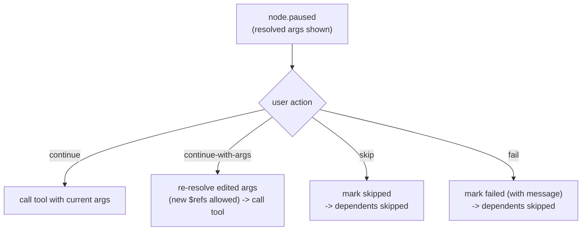

import useBaseUrl from '@docusaurus/useBaseUrl';

# Breakpoints & Debugging

A workflow engine that you cannot pause is a black box. MCP Playground treats a
run like a debugger session: you can pause a node before its tool is called or on the fly when workflow is running,
inspect the exact resolved arguments, edit them, and then continue, skip, or
fail.

## The four pause actions

When a node pauses, the UI (or CLI) replies with one of four actions:

```startLine:148:152:MCP-Playground/backend/src/types/workflow.ts
export type PauseAction =
  | { type: 'continue' }
  | { type: 'continue-with-args'; args: Record<string, unknown> }
  | { type: 'skip' }
  | { type: 'fail'; error: string };
```



## Node-Scoped Breakpoints

Because the scheduler awaits in-flight nodes with `Promise.race`, a breakpoint
pauses only that node's execution. Its promise stays pending while the other
branches' promises resolve; the main loop processes those completions and keeps
the DAG advancing everywhere that is not downstream of the paused node.

This also means multiple nodes can be paused at the same time on parallel
branches. The WebSocket pause handler simply parks one resolver per node id and
resolves the right one when its `pauseAction` arrives:

```startLine:27:43:MCP-Playground/backend/src/server/ws-pause-handler.ts
  onBreakpoint(_ctx: BreakpointContext): Promise<PauseAction> {
    return new Promise<PauseAction>((resolve) => {
      this.pending.set(_ctx.nodeId, resolve);
    });
  }

  /**
   * Resolve a node that is currently paused. Returns false (no-op) if the node
   * isn't actually parked at a breakpoint — e.g. a stale frame after cancel.
   */
  resolve(nodeId: string, action: PauseAction): boolean {
    const resolve = this.pending.get(nodeId);
    if (!resolve) return false;
    this.pending.delete(nodeId);
    resolve(action);
    return true;
  }
```

## Cancellation Interrupts Paused Nodes

A workflow can be cancelled even if one or more nodes are currently paused at breakpoints. Paused nodes do not block cancellation.

When a cancellation request is received, the executor aborts all in-flight work and releases any nodes waiting at breakpoints. The abort signal takes precedence over pending pause states, allowing the workflow to terminate immediately without requiring user interaction.

As a result, breakpoints cannot prevent or delay cancellation. A workflow remains cancellable regardless of how many nodes are paused or where those pauses occur in the dependency graph.

## The live debugger loop

<div className="img-gallery">
  <figure>
    
    <figcaption>A run paused at a breakpoint on <code>get_cluster_by_id</code>: the inspector shows the node's <code>$ref</code> argument and the <strong>Live Resolved Args</strong> the tool is about to receive (<code>extId</code> resolved from the upstream <code>list_clusters</code> result), with Resume / Skip controls. Only one branch is parked (<code>paused (1)</code>) - the rest of the DAG keeps running.</figcaption>
  </figure>
</div>

Putting it together, the debug loop the user experiences is:

1. Arm a breakpoint (authored, or click a node mid-run).
2. The engine emits `node.paused` with the fully resolved arguments.
3. The UI shows the tool, the resolved args, and the source (`authored` /
   `runtime`).
4. The user inspects, optionally edits the args, then continues / skips / fails.
5. The engine emits `node.resumed` and the run proceeds while other branches are never
   stopped.
