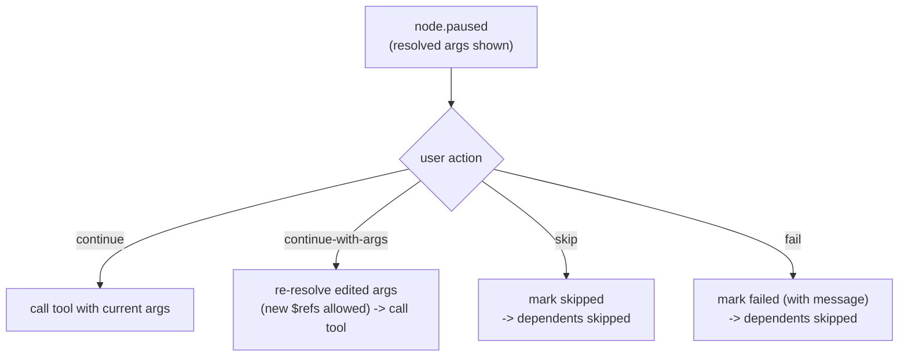

# Breakpoints & Debugging

A workflow engine that you cannot pause is a black box. MCP Playground treats a
run like a debugger session: you can pause a node **before its tool is called**,
inspect the exact resolved arguments, edit them, and then continue, skip, or
fail - all while the rest of the graph keeps running.

## Two sources, one source of truth

Breakpoints come from two places:

- **Authored** - `"breakpoint": true` on a node in the workflow JSON.
- **Runtime** - the UI (or CLI) arms one with `setBreakpoint(nodeId)` while the
  workflow is already running.

The elegant part: at run start, authored breakpoints are **seeded into the same
mutable runtime set**, which then becomes the single source of truth for "is
this node armed." That means a breakpoint can be toggled *off* on the fly -
including an authored one - and re-armed, all through one set.

```startLine:162:166:MCP-Playground/backend/src/workflow/executor.ts
  setBreakpoint(nodeId: string): void {
    if (this.runtimeBreakpoints.has(nodeId)) return;
    this.runtimeBreakpoints.add(nodeId);
    this.emit({ type: 'breakpoint.added', nodeId });
  }
```

The check happens **just before** the tool call, and is re-read at that moment -
so a breakpoint added after a node went ready but before it ran still takes
effect.

## The four pause actions

When a node pauses, the UI (or CLI) replies with one of four actions:

```startLine:148:152:MCP-Playground/backend/src/types/workflow.ts
export type PauseAction =
  | { type: 'continue' }
  | { type: 'continue-with-args'; args: Record<string, unknown> }
  | { type: 'skip' }
  | { type: 'fail'; error: string };
```



The most powerful action is **`continue-with-args`**: the user's edit is treated
as the new authored form, stored, and run through the **same `$ref` resolution
pipeline** - so you can even introduce a *new* reference to another completed
node's output at the breakpoint, and it resolves correctly.

```startLine:417:433:MCP-Playground/backend/src/workflow/executor.ts
      if (outcome.kind === 'args') {
        // User overrode the args at the breakpoint. Treat their input as the
        // new "authored" form: store it in typedArgs and run it through the
        // same resolve pipeline, in case they introduced new $refs pointing
        // at other completed nodes. If the new args fail to resolve, the
        // node is finalized as failed inside tryResolveArgs.
        state.typedArgs = outcome.args;
        const reresolved = this.tryResolveArgs(
          outcome.args,
          state,
          results,
          startedAt,
        );
        if (reresolved === null) return { nodeId: node.id };
        resolvedArgs = reresolved;
        state.resolvedArgs = resolvedArgs;
      }
```

## Pausing one branch, not the whole run

Because the scheduler awaits in-flight nodes with `Promise.race`, a breakpoint
pauses **only that node's** execution. Its promise stays pending while the other
branches' promises resolve; the main loop processes those completions and keeps
the DAG advancing everywhere that is not downstream of the paused node.

This also means **multiple nodes can be paused at the same time** on parallel
branches. The WebSocket pause handler simply parks one resolver per node id and
resolves the right one when its `pauseAction` arrives:

```startLine:27:43:MCP-Playground/backend/src/server/ws-pause-handler.ts
  onBreakpoint(_ctx: BreakpointContext): Promise<PauseAction> {
    return new Promise<PauseAction>((resolve) => {
      this.pending.set(_ctx.nodeId, resolve);
    });
  }

  /**
   * Resolve a node that is currently paused. Returns false (no-op) if the node
   * isn't actually parked at a breakpoint — e.g. a stale frame after cancel.
   */
  resolve(nodeId: string, action: PauseAction): boolean {
    const resolve = this.pending.get(nodeId);
    if (!resolve) return false;
    this.pending.delete(nodeId);
    resolve(action);
    return true;
  }
```

## Cancellation never deadlocks on a pause

A paused node is awaiting a human. What if the run is cancelled while it waits?
The pause is **raced against the abort signal**, so cancellation always wins: on
abort, every parked pause is resolved with `continue`, and the executor's
internal signal race marks the node as "caught mid-flight" rather than resuming
it. A breakpoint can never wedge a cancellation.

## The live debugger loop

Putting it together, the debug loop the user experiences is:

1. Arm a breakpoint (authored, or click a node mid-run).
2. The engine emits `node.paused` with the fully **resolved** arguments.
3. The UI shows the tool, the resolved args, and the source (`authored` /
   `runtime`).
4. The user inspects, optionally edits the args, then continues / skips / fails.
5. The engine emits `node.resumed` and the run proceeds - other branches never
   stopped.

:::note Figure to capture
A screenshot of a node **paused** on the canvas with its resolved arguments in
the inspector (plus the live event log) belongs here; it needs a running UI.
:::
