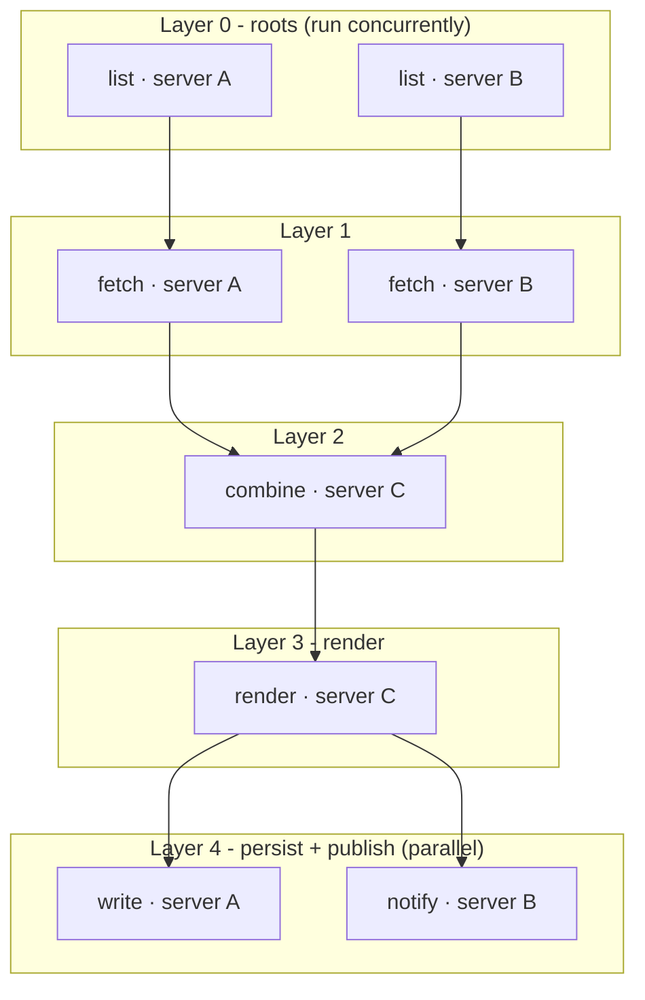

# Building Workflows

A workflow in MCP Playground is a **directed acyclic graph (DAG) of tool
calls**. Each node names one tool and its arguments; edges express ordering and
data flow. The engine figures out what can run, in what order, and what can run
at the same time.

We discuss about how a workflow is structured, how multiple workflows can span many MCP servers, and parallelism among nodes execution. We will discuss later about:

- [Data Flow & Live References](./data-flow-references.mdx) - how a node reads
  an upstream node's result with `$ref`.
- [Breakpoints & Debugging](./breakpoints-debugging.mdx) - how to pause,
  inspect, edit, and resume a run.

## The workflow model

A workflow is a small JSON document: an `id`, a `version`, an optional `name`,
and a list of `nodes`. Every node is one tool call:

| Field | Meaning |
| --- | --- |
| `id` | Unique name for the node, referenced by `$ref` and `dependsOn`. |
| `tool` | The namespaced tool to call, in `server__tool` form. |
| `args` | The arguments object - literals and/or `$ref`s into upstream results. |
| `dependsOn` | Optional explicit ordering edges (data-flow edges are inferred). |
| `breakpoint` | Optional `true` to pause the run before this node executes. |

```json
{
  "id": "enrich-and-store",
  "version": 1,
  "nodes": [
    { "id": "fetch",     "tool": "serverA__list_items", "args": { "limit": 50 } },
    { "id": "transform", "tool": "serverC__summarize",
      "args": { "rows": { "$ref": { "nodeId": "fetch", "path": "$.structuredContent.items" } } } },
    { "id": "store",     "tool": "serverB__write_file",
      "args": { "path": "out.json",
                "data": { "$ref": { "nodeId": "transform", "path": "$.content[0].text" } } } }
  ]
}
```

Dependencies are usually inferred rather than declared. When a node references another node's output with `$ref`, that relationship is automatically added to the execution graph.

## Multi-layered, multi-nodal

Workflows are represented as directed dependency graphs rather than linear sequences. Nodes can execute in parallel whenever their dependencies have been satisfied. The executor derives execution stages from the graph topology: nodes with no incoming dependencies form the initial stage, and each completed node may make additional downstream nodes eligible for execution. These stages are computed automatically from the dependency graph; they are not declared explicitly.

## One workflow, many MCP servers

The most important property: **a single workflow can call tools from many
different MCP servers.** When the backend connects, it merges every server's
tools into one **namespaced catalog** where each tool is addressed as
`server__tool`. A node just names the tool it wants - `serverA__list_items`,
`serverC__summarize`, `serverB__write_file` - and the proxy routes the call to
the right server.

That means a workflow can freely mix:

- a **local `npx`** server (e.g. a filesystem or chart server),
- a **hosted / remote** server, and
- a **custom** server (such as the bundled [Prism MCP](./prism-morpheus-mcp.mdx)),

all in the same run, with data flowing across server boundaries via `$ref`.
Different tools, different MCP configs, one graph.

## Parallel Execution

The engine extracts parallelism from the graph and it does so at two levels.

### 1. Parallel branches inside one workflow

Any nodes whose dependencies are already satisfied run **concurrently**. The
scheduler keeps a `ready` set and an `inflight` map: it launches every ready
node at once, then awaits `Promise.race` over the in-flight calls, unlocking
each node's dependents the instant it finishes. This is what makes fan-out /
fan-in natural - independent branches simply proceed in parallel.

```startLine:287:300:MCP-Playground/backend/src/workflow/executor.ts
      if (!signal?.aborted) {
        for (const nodeId of [...ready]) {
          ready.delete(nodeId);
          const node = nodeById.get(nodeId)!;
          inflight.set(nodeId, this.runNode(node, states, results, signal));
        }
      } else {
        ready.clear();
      }

      if (inflight.size === 0) break;

      const { nodeId: finished } = await Promise.race(inflight.values());
```

### 2. Many workflows at once on one session

A single connection can run **multiple whole workflows concurrently.** Each
`runWorkflow` carries its own `runId`, and the `Session` keys every active run
in a map so independent runs (each with its own executor, abort controller,
and breakpoint state) execute side by side and stream events independently.

```startLine:141:160:MCP-Playground/backend/src/server/session.ts
    if (this.runs.has(msg.runId)) {
      this.send({ type: 'error', runId: msg.runId, error: `Run "${msg.runId}" is already active` });
      return;
    }

    const abort = new AbortController();
    const pauseHandler = new WsPauseHandler(abort.signal);
    const executor = new WorkflowExecutor(
      {
        call: (qualifiedName, args, options) =>
          this.manager.callTool(qualifiedName, args, options),
      },
      pauseHandler,
    );

    // Stream every EngineEvent straight onto the socket under the client's runId.
    const off = executor.on((event) =>
      this.send({ type: 'engineEvent', runId: msg.runId, event }),
    );
    this.runs.set(msg.runId, { executor, abort, pauseHandler });
```

## A generic multi-layer DAG

The workflow below illustrates how execution is derived entirely from dependency edges. Nodes with no incoming dependencies (`a1`, `b1`) can start immediately and run in parallel. As nodes complete, their dependents become eligible for execution. Nodes with multiple upstream dependencies, such as `c1`, do not start until all required inputs are available. Once `c2` completes, both downstream nodes (`a3`, `b3`) become runnable and may execute concurrently.

The labels indicate the MCP server invoked by each node. In this example, servers **A**, **B**, and **C** participate in the same workflow, while execution remains coordinated by a single dependency graph.



No execution stages or layer numbers are defined in the workflow itself. The executor derives them dynamically from the dependency graph, scheduling any node whose dependencies have been satisfied.

With the model in hand, we now explain the two mechanisms that make these workflows expressive and safe: **data flow** and **breakpoints**.
