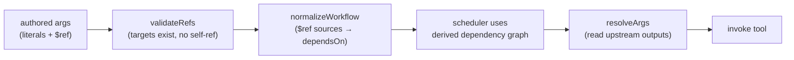

import useBaseUrl from '@docusaurus/useBaseUrl';

# Data Flow & Live References

The thing that makes a workflow a *graph* is `$ref` as it is a way to
pipe any field of one node's result into another node's arguments. Here, we
cover how a reference is written, resolved, validated, and, crucially how
the UI helps the user author one without guessing field paths.

## The shape of a reference

Anywhere a node argument expects a value, you can instead place a `$ref`. It
names an upstream node and a JSONPath into that node's result:

```json
{
  "message": { "$ref": { "nodeId": "sum", "path": "$.content[0].text" } }
}
```

The schema (validated with `zod`) is small and the `path` defaults to `$` (the
whole result):

```startLine:7:14:MCP-Playground/backend/src/types/workflow.ts
export const ValueRefSchema = z.object({
  $ref: z.object({
    nodeId: z.string().min(1, 'nodeId is required'),
    path: z.string().default('$'),
  }),
});

export type ValueRef = z.infer<typeof ValueRefSchema>;
```

A reference replaces the whole value
`$ref` resolution substitutes a value; it does not interpolate a reference
into a larger string. An argument is either a literal or a single `$ref`. This
keeps resolution unambiguous and easy to reason about.

## Resolution: `resolveArgs`

At run time, just before a node's tool is called, the executor walks its
arguments and replaces every `$ref` with the resolved value, recursing through
nested objects and arrays:

```startLine:32:63:MCP-Playground/backend/src/workflow/refs.ts
export function resolveArgs(
  args: unknown,
  done: Map<string, unknown>,
): unknown {
  if (args === null || args === undefined) return args;

  if (isValueRef(args)) {
    const { nodeId } = args.$ref;
    const path = args.$ref.path ?? '$';
    if (!done.has(nodeId)) {
      throw new RefResolutionError(
        `Cannot resolve $ref: node "${nodeId}" has not produced a result yet`,
      );
    }
    const source = done.get(nodeId);
    return jsonPath(source, path);
  }

  if (Array.isArray(args)) {
    return args.map((a) => resolveArgs(a, done));
  }

  if (typeof args === 'object') {
    const out: Record<string, unknown> = {};
    for (const [k, v] of Object.entries(args as Record<string, unknown>)) {
      out[k] = resolveArgs(v, done);
    }
    return out;
  }

  return args;
}
```

## Data flow *is* dependency

Users rarely need to declare `dependsOn` explicitly. When a node references another node's output through `$ref`, that dependency is inferred automatically during workflow normalization.

During `normalizeWorkflow`, the engine scans each node for `$ref` expressions, identifies the referenced source nodes, and adds those nodes to the node's dependency set. As a result, the execution graph reflects the workflow's data flow without requiring users to duplicate dependency declarations.

At runtime, the scheduler uses this graph to determine execution order. A node cannot run until all of its dependencies have completed, ensuring that any values referenced through `$ref` are available when arguments are resolved.



For example, if a node references the output of `sum` via `$ref`, `sum` is automatically added as a dependency. The scheduler will not execute the dependent node until `sum` has completed successfully.
At runtime, the scheduler uses the derived dependency graph to determine execution order. Once a node's dependencies have completed, any `$ref` expressions in its arguments are resolved against the corresponding upstream results before the tool is invoked. References can target nested object fields and array elements, and invalid paths produce descriptive errors to simplify debugging.

## Structured Enrichment

Different MCP servers return results in different shapes. Many older servers put
their payload in a text block as a JSON string and never populate the
structured-output field, which would mean a `$ref` could only ever reach the
whole blob never a nested field. The proxy fixes this uniformly and
conservatively by lifting a JSON text block into `structuredContent`:

```startLine:294:323:MCP-Playground/backend/src/mcp/client-manager.ts
export function enrichWithStructuredContent(result: unknown): unknown {
  if (typeof result !== 'object' || result === null) return result;
  const r = result as Record<string, unknown>;

  // Respect servers that already emit structured output.
  if (r.structuredContent !== undefined) return result;

  const content = r.content;
  if (!Array.isArray(content) || content.length === 0) return result;

  const first = content[0] as { type?: unknown; text?: unknown } | null;
  if (!first || first.type !== 'text' || typeof first.text !== 'string') {
    return result;
  }

  const text = first.text.trim();
  // Cheap guard: only attempt a parse for things that look like JSON
  // objects/arrays. Skips prose and primitives without paying for a throw.
  if (text[0] !== '{' && text[0] !== '[') return result;

  try {
    const parsed: unknown = JSON.parse(text);
    if (parsed !== null && typeof parsed === 'object') {
      return { ...r, structuredContent: parsed };
    }
  } catch {
    // Not valid JSON — leave the text-only result untouched.
  }
  return result;
}
```

In practice, this means a result lands at a predictable path regardless of how a
server chooses to format it:

- Servers that emit **structured output** expose their fields directly, e.g.
  `$.structuredContent.someField`.
- Servers that return a **JSON string in a text block** are enriched (above), so
  nested fields become reachable under `$.structuredContent...`.
- Servers that return **plain prose or text** keep it at `$.content[0].text`.

## The Path Suggester

Authoring JSONPath by hand is error-prone, so the canvas does it for you. When you wire a `$ref`, the picker (`RefPickerModal`) inspects the source node's saved result and lists every resolvable path - each with its runtime type and a value preview - while a type filter narrows the list to what the target argument expects.

<div className="img-gallery">
  <figure>
    
    <figcaption>Picking a value from a live <code>nutanix__list_clusters</code> result - 179 typed, previewed paths (filterable by type) over the raw response.</figcaption>
  </figure>
</div>

The paths come from `suggestJsonPaths`, which walks the result using the **same JSONPath grammar the runtime resolver uses** - so every suggestion is guaranteed to resolve at execution time. That same inventory also feeds the AI mapping service, which pairs it with tool schemas to recommend (or auto-build) node-to-node mappings.
