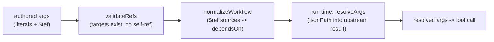

# Data Flow & Live References

The thing that makes a workflow a *graph* and not a *list* is `$ref`: a way to
pipe any field of one node's result into another node's arguments. This chapter
covers how a reference is written, resolved, validated, and - crucially - how
the UI helps you author one without guessing field paths.

## The shape of a reference

Anywhere a node argument expects a value, you can instead place a `$ref`. It
names an upstream node and a JSONPath into that node's result:

```json
{
  "message": { "$ref": { "nodeId": "sum", "path": "$.content[0].text" } }
}
```

The schema (validated with `zod`) is small and the `path` defaults to `$` (the
whole result):

```startLine:7:14:MCP-Playground/backend/src/types/workflow.ts
export const ValueRefSchema = z.object({
  $ref: z.object({
    nodeId: z.string().min(1, 'nodeId is required'),
    path: z.string().default('$'),
  }),
});

export type ValueRef = z.infer<typeof ValueRefSchema>;
```

:::info A reference replaces the *whole* value
`$ref` resolution substitutes a value; it does **not** interpolate a reference
into a larger string. An argument is either a literal or a single `$ref`. This
keeps resolution unambiguous and easy to reason about - the value a node
receives is exactly one upstream result (or a path into it), never a templated
mix of text and references.
:::

## Resolution: `resolveArgs`

At run time, just before a node's tool is called, the executor walks its
arguments and replaces every `$ref` with the resolved value, recursing through
nested objects and arrays:

```startLine:32:63:MCP-Playground/backend/src/workflow/refs.ts
export function resolveArgs(
  args: unknown,
  done: Map<string, unknown>,
): unknown {
  if (args === null || args === undefined) return args;

  if (isValueRef(args)) {
    const { nodeId } = args.$ref;
    const path = args.$ref.path ?? '$';
    if (!done.has(nodeId)) {
      throw new RefResolutionError(
        `Cannot resolve $ref: node "${nodeId}" has not produced a result yet`,
      );
    }
    const source = done.get(nodeId);
    return jsonPath(source, path);
  }

  if (Array.isArray(args)) {
    return args.map((a) => resolveArgs(a, done));
  }

  if (typeof args === 'object') {
    const out: Record<string, unknown> = {};
    for (const [k, v] of Object.entries(args as Record<string, unknown>)) {
      out[k] = resolveArgs(v, done);
    }
    return out;
  }

  return args;
}
```

## Data flow *is* dependency

You never have to declare ordering by hand for a `$ref`. During
`normalizeWorkflow`, every node's `$ref` sources are **folded into its
`dependsOn`** set, so the dependency graph the scheduler walks already encodes
the data flow. A node that reads `sum`'s output automatically waits for `sum`.



## A small, predictable JSONPath

The resolver implements a deliberately **minimal JSONPath subset** - enough to
reach into real tool results, with no surprising behavior:

- Supported: `$`, `$.foo`, `$.foo.bar`, `$.foo[0]`, `$["weird.key"]`, and
  arbitrary mixing like `$.foo[0].bar`.
- Deliberately **not** supported in v1: wildcards (`$[*]`), recursive descent
  (`$..foo`), and filter expressions (`$[?(...)]`).

Errors are specific and actionable - "Path `$.a.b` expected object at `.b` but
found array" - rather than a silent `undefined`.

## Making every server's output reachable: structured enrichment

Different MCP servers return results in different shapes. Many older servers put
their payload in a text block as a JSON *string* and never populate the
structured-output field, which would mean a `$ref` could only ever reach the
whole blob - never a nested field. The proxy fixes this **uniformly and
conservatively** by lifting a JSON text block into `structuredContent`:

```startLine:294:323:MCP-Playground/backend/src/mcp/client-manager.ts
export function enrichWithStructuredContent(result: unknown): unknown {
  if (typeof result !== 'object' || result === null) return result;
  const r = result as Record<string, unknown>;

  // Respect servers that already emit structured output.
  if (r.structuredContent !== undefined) return result;

  const content = r.content;
  if (!Array.isArray(content) || content.length === 0) return result;

  const first = content[0] as { type?: unknown; text?: unknown } | null;
  if (!first || first.type !== 'text' || typeof first.text !== 'string') {
    return result;
  }

  const text = first.text.trim();
  // Cheap guard: only attempt a parse for things that look like JSON
  // objects/arrays. Skips prose and primitives without paying for a throw.
  if (text[0] !== '{' && text[0] !== '[') return result;

  try {
    const parsed: unknown = JSON.parse(text);
    if (parsed !== null && typeof parsed === 'object') {
      return { ...r, structuredContent: parsed };
    }
  } catch {
    // Not valid JSON — leave the text-only result untouched.
  }
  return result;
}
```

In practice, this means a result lands at a predictable path regardless of how a
server chooses to format it:

- Servers that emit **structured output** expose their fields directly, e.g.
  `$.structuredContent.someField`.
- Servers that return a **JSON string in a text block** are enriched (above), so
  nested fields become reachable under `$.structuredContent...`.
- Servers that return **plain prose or text** keep it at `$.content[0].text`.

## Authoring without guessing: the path suggester

Typing a JSONPath from memory is exactly the error-prone glue work the
Playground removes. The UI's **"pick a value from the response"** modal
(`RefPickerModal`) shows a source node's *actual* saved result and a clickable
list of every JSONPath into it, derived by `suggestJsonPaths`. Each suggestion
is tagged with the runtime type of its value, and the list can be filtered to
the type the target argument expects.

```startLine:43:60:MCP-Playground/frontend/src/lib/workflow/suggest.ts
export function suggestJsonPaths(
  value: unknown,
  opts: { maxPaths?: number; maxDepth?: number; arraySample?: number } = {},
): PathSuggestion[] {
  const maxPaths = opts.maxPaths ?? 400;
  const maxDepth = opts.maxDepth ?? 12;
  const arraySample = opts.arraySample ?? 5;

  const out: PathSuggestion[] = [];
  const seen = new Set<string>();
  const push = (p: string, v: unknown) => {
    if (seen.has(p)) return;
    seen.add(p);
    out.push({ path: p, type: valueType(v) });
  };
```

The path grammar used by the suggester matches the resolver exactly, so a path
you click is guaranteed to be one the engine can resolve. This same "schema plus
real response" context is what the [AI service](./ai-services.md) consumes to
recommend mappings automatically.

:::note Figure to capture
A screenshot of the **"Pick a value from the response"** modal (the suggested
paths list with type badges, alongside the raw result) belongs here. It needs a
live run of the UI to capture.
:::
