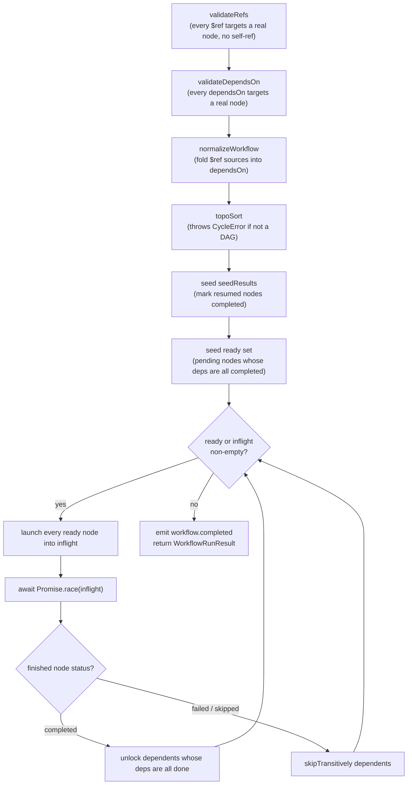
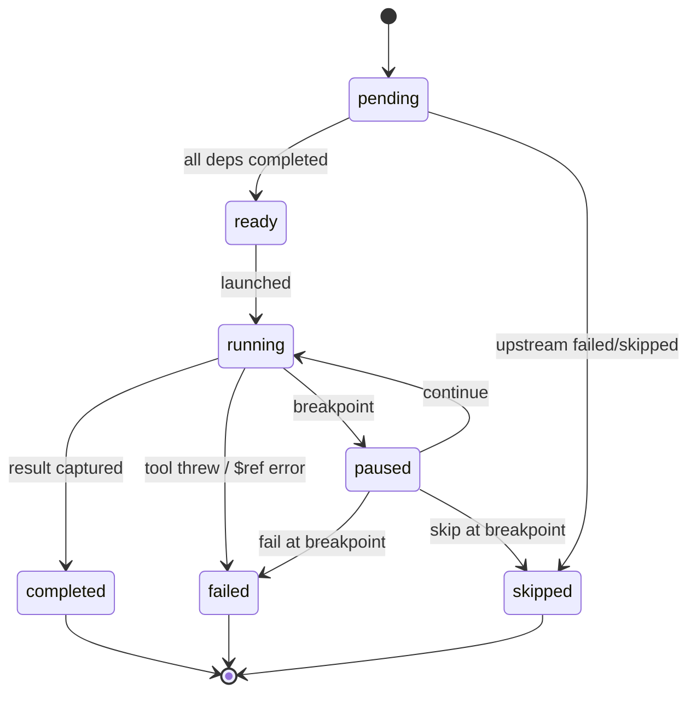

# The Executor Engine

The `WorkflowExecutor` is the heart of the
system. It takes a validated `Workflow` and turns it into a live run: it
resolves the dependency graph, schedules independent nodes **in parallel**,
pipes data between them, emits a stream of events, and cooperates with
breakpoints, cancellation, and resume.

## The Run Lifecycle

The executor is deliberately UI-agnostic and transport-agnostic.

```startLine:28:53:MCP-Playground/backend/src/workflow/executor.ts
export interface ToolCaller {
  call(
    qualifiedName: string,
    args: Record<string, unknown>,
    options?: { signal?: AbortSignal },
  ): Promise<unknown>;
}

/**
 * Handles a breakpoint pause. The executor stays UI-agnostic by calling out
 * to whatever handler was passed in. The CLI's implementation is a
 * stdin-driven "press Enter to continue"; the future WebSocket
 * implementation broadcasts the pause context, awaits a user action over the
 * wire, and resolves the promise with that action.
 */
export interface PauseHandler {
  onBreakpoint(
    ctx: BreakpointContext,
    signal?: AbortSignal,
  ): Promise<PauseAction>;
}
```

Every call to `run()` follows the same lifecycle. Validation runs against the
**original** workflow, then the graph is normalized and scheduled.



## Nodes Scheduler

The scheduler is a classic Kahn-style topological walk, but driven by promises
so independent branches run concurrently. The main loop keeps two collections -
a `ready` set and an `inflight` map - and races the in-flight promises so the
**first node to finish anywhere in the graph** is processed immediately, and its
dependents are unlocked.

```startLine:279:325:MCP-Playground/backend/src/workflow/executor.ts
    while (ready.size > 0 || inflight.size > 0) {
      // Cancellation gate: once aborted, stop launching new work. Ready
      // nodes simply don't start (they keep status 'ready'). In-flight
      // nodes still get awaited so their tool calls can wind down ...
      if (!signal?.aborted) {
        for (const nodeId of [...ready]) {
          ready.delete(nodeId);
          const node = nodeById.get(nodeId)!;
          inflight.set(nodeId, this.runNode(node, states, results, signal));
        }
      } else {
        ready.clear();
      }

      if (inflight.size === 0) break;

      const { nodeId: finished } = await Promise.race(inflight.values());
      inflight.delete(finished);

      const state = states.get(finished)!;
      if (state.status === 'completed') {
        for (const dependentId of outgoing.get(finished) ?? []) {
          const depState = states.get(dependentId);
          if (!depState || depState.status !== 'pending') continue;
          if (allDepsCompleted(dependentId, incoming, states)) {
            depState.status = 'ready';
            ready.add(dependentId);
            this.emit({ type: 'node.ready', nodeId: dependentId });
          }
        }
      } else if (state.status === 'failed' || state.status === 'skipped') {
        this.skipTransitively(
          finished,
          outgoing,
          states,
          reasonForSkip(state),
        );
      }
```

This gives **maximal parallelism for free**: any set of nodes whose dependencies
are all satisfied run at the same time, and a slow branch never blocks a fast
one.

## Node states

Each node walks through a small state machine.



Note: When a node completes, its result is cached so downstream `$ref`s can read it.
When a node fails or is skipped, every node transitively downstream is
marked `skipped` with a reason that points back to the cause so one failure
prunes exactly the affected subgraph and nothing else, and user can retry without re-running the entire workflow.

## The event stream

The executor extends an `EventEmitter` and emits a typed `EngineEvent` for every
meaningful transition: `workflow.started`, `node.ready`, `node.started`,
`node.paused`, `node.resumed`, `breakpoint.added`, `breakpoint.cleared`,
`node.completed`, `node.failed`, `node.skipped`, and `workflow.completed`. These
are the exact frames the UI renders live and the CLI prints to stderr - the same
stream, two front-ends.
