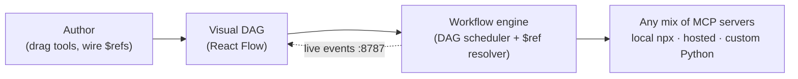

# MCP Playground

> **Build, run, and debug multi-MCP workflows on a visual canvas.**

MCP Playground is a visual environment for **wiring up multiple [Model Context
Protocol](https://modelcontextprotocol.io) servers as a node graph**, passing
data between tool calls with `$ref`, setting breakpoints, and watching every
step execute live over a WebSocket.

It ships with a **custom Prism MCP** (a FastAPI service plus a generated MCP
server over real, collected Nutanix data) and a set of end-to-end examples you
can run, step through, and adapt - the most elaborate of which orchestrates
several MCP servers in a single run (walked through in the
[live example](./live-example-dashboard.mdx)).

  

    
1

    
shared engine behind the UI and the CLI

  

  

    
2

    
JSON files define a run (config + workflow)

  

  

    
3

    
kinds of MCP server: local, hosted, custom

  

  

    
0

    
databases or telemetry - runs stay local

  

## The problem

The Model Context Protocol standardized *how* an AI client talks to a single
tool server. But real automation rarely uses one server - it stitches several
together: read data from one tool, transform it, render a chart with another,
persist with a third, publish with a fourth.

Today that orchestration is **hand-written glue code**:

- You manually thread one tool's JSON output into the next tool's arguments,
  guessing at field paths from memory.
- When a call fails midway, there is **no way to pause, inspect, and resume** -
  you re-run the whole script and add `print` statements.
- Mixing a local `npx` server, a hosted server, and your own custom server
  means juggling transports, environment variables, and lifecycles by hand.
- There is no shared, visual artifact a teammate (or a hackathon judge) can look
  at to understand what the automation actually *does*.

## What MCP Playground gives you

A canvas where an MCP workflow is a **directed acyclic graph (DAG)** of tool
calls, and the runtime is a real debugger:

## Key features

- **Visual DAG editor** for MCP tool calls, built on React Flow.
- **`$ref` data flow** - pipe any field of one node's result into another's
  arguments via JSONPath, with a clickable "pick from the response" helper.
- **Breakpoints and step-through** - pause a run at chosen nodes and inspect
  resolved arguments and results before continuing.
- **Multi-MCP orchestration** - mix local `npx` servers, a remote/hosted server,
  and a custom Python MCP in a single workflow.
- **Live WebSocket debugger** - per-node `started / paused / completed / failed`
  events stream to the UI as they happen.
- **Headless CLI** - run any workflow without the UI (`list-tools`,
  `call-tool`, `run-workflow` with `--break-at`), so workflows are CI-runnable.
- **Portable Python MCP via [`uv`](https://docs.astral.sh/uv/)** - no manual
  virtualenvs; `uv` provisions dependencies on first launch.

## Who it's for

- **Builders of agentic / multi-tool automations** who want a faster, safer loop
  than hand-wiring MCP calls in a script.
- **Platform and infra engineers** turning an existing API (for example,
  Nutanix Prism) into composable, AI-callable tools.
- **Teams and reviewers** who want a single visual artifact that explains - and
  can re-run - what an automation does.

## How to read this document

This is a single, top-to-bottom technical document. The chapters build on each
other:

1. **Overview & Use Cases** (you are here)
2. **Architecture** - the moving parts and the end-to-end request flow
3. **The Executor Engine** - the heart of the system (DAG scheduling, data flow,
   cancellation, resume)
4. **Workflows** - building multi-layer DAGs across MCPs, plus the two mechanisms
   that power them:
   - **Building Workflows** - the model, parallelism, and use cases
   - **Data Flow & Live References** - the `$ref` model and the suggestion engine
   - **Breakpoints & Debugging** - pause, inspect, edit, resume
5. **The CLI** - the headless, local-by-default runner
6. **The Custom Prism MCP** - turning Nutanix data into MCP tools via Morpheus
7. **Live Example** - an end-to-end, multi-server workflow
8. **AI Services** - smart argument mapping (in progress)
9. **Design Discussions** - the system design and why
10. **Impact & Business Value** - generic and Nutanix-specific
11. **Testimonials**

:::note Source-grounded
Every technical claim in this document is grounded in the project source. Where
a feature is still in progress, or where a figure needs a human to confirm, it
is called out explicitly rather than assumed.
:::
