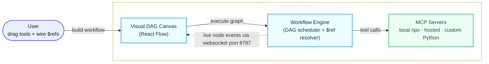

# MCP Playground

> **Build, run, and debug multi-MCP workflows on a visual canvas.**

MCP Playground is a visual environment for **wiring up multiple [Model Context
Protocol](https://modelcontextprotocol.io) servers as a node graph**, passing
data between tool calls with `$ref`, setting breakpoints, and watching every
step execute live over a WebSocket.

You can create, save, and run multiple workflows in the playground to compare and reuse automation patterns.

## The problem

AI tool integration is standardized at the single-tool level, but real
automation is inherently multi-system. Teams still have to stitch together
data retrieval, transformation, content generation, persistence, and publishing
across disconnected services, which adds complexity and failure points.

Today that orchestration is **hand-written glue code**:

- You manually thread one tool's JSON output into the next tool's arguments,
  guessing at field paths from memory.
- When a call fails midway, there is **no way to pause, inspect, and resume** -
  you re-run the whole script and add `print` statements.
- Mixing a local `npx` server, a hosted server, and your own custom server
  means juggling transports, environment variables, and lifecycles by hand.

## What MCP Playground gives you

A canvas where an MCP workflow is a **directed acyclic graph (DAG)** of tool
calls, and the runtime is a real debugger:

## Key features

- **Multi-MCP orchestration** - run local `npx`, hosted, and custom Python MCP servers in one workflow.
- **Visual DAG editor** - design MCP tool-call graphs interactively with React Flow.
- **`$ref` data flow** - map output fields to downstream args with JSONPath and response picking.
- **Smart argument auto-mapping** - suggest likely `$ref` links between tool outputs and next-step inputs.
- **Breakpoints and step-through** - pause the workflow at nodes to inspect resolved args and outputs.
- **Live WebSocket debugger** - stream per-node `started / paused / completed / failed` events in real time.
- **Headless CLI** - run workflows without UI (`list-tools`, `call-tool`, `run-workflow --break-at`) for CI.

## Use cases

- **Morpheus-to-Playground Workflow Factory:** Morpheus (a SaaS platform) can generate MCP servers from REST Swagger/OpenAPI links, and those generated servers can be plugged into MCP Playground for orchestration and end-to-end workflow building.
- **Multi-Server Orchestration:** Aggregate multiple independent MCP servers onto a single canvas to build cohesive, 
cross-platform workflows. This allows tools from entirely different environments to pass data to each other seamlessly.
- **Zero-Client Visual Testing:** Provides an interactive drag-and-drop scratchpad to test tools visually right out of the box. 
This eliminates the need to build custom client code or run tedious terminal commands just to verify endpoints.
- **Sandboxed Step-Debugging:** Use a step-debugger with live breakpoints to safely dry-run automation sequences before deploying them. 
Developers can halt execution mid-flight and tweak argument payloads to safely test edge cases.
- **Black-Box to Glass-Box Visibility:** Translate invisible backend text traffic into an illuminated, color-coded node graph layout. 
This gives developers total visibility into data interactions and dependencies, making bug-tracking effortless.
