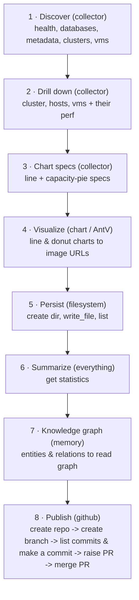

import Tabs from '@theme/Tabs';
import TabItem from '@theme/TabItem';
import useBaseUrl from '@docusaurus/useBaseUrl';

# Example: Metrics-to-Dashboard Pipeline

To showcase MCP Playground's orchestration capabilities, we built an end-to-end analytics workflow spanning six MCP servers and 61 workflow nodes. In a single execution, the workflow collects infrastructure data from Nutanix Prism, generates visual dashboards, persists artifacts, builds a knowledge graph, and publishes the results to a newly created GitHub repository through an automated pull request workflow.

The entire process is defined declaratively as a DAG and executed by the MCP Playground engine. Data flows across server boundaries through references, while breakpoints allow each stage to be inspected, debugged, and controlled in real time.

**61 Nodes • 8 Layers • 6 MCP Servers • 1 Click**

<div className="img-gallery">
  <figure>
    
    <figcaption>The entry point - drop in one <code>mcp-config.json</code> and all six servers are parsed and "ready to connect"; one click opens the workspace.</figcaption>
  </figure>
</div>

## MCP Servers Config

The whole orchestration is declared in one `mcp-config.json`. Five servers run
via `npx`; the sixth is the Collector MCP Server built from **Morpheus** launched with `uv`.

<Tabs>
<TabItem value="config" label="mcp-config (6 servers)" default>

```json
{
  "mcpServers": {
    "collector": {
      "command": "uv",
      "args": ["run", "--directory", "<repo>/prism-mcp/mcp-server", "python", "server.py"]
    },
    "chart":      { "command": "npx", "args": ["-y", "@antv/mcp-server-chart"] },
    "filesystem": { "command": "npx", "args": ["-y", "@modelcontextprotocol/server-filesystem", "<example-dir>"] },
    "everything": { "command": "npx", "args": ["-y", "@modelcontextprotocol/server-everything"] },
    "memory":     { "command": "npx", "args": ["-y", "@modelcontextprotocol/server-memory"] },
    "github": {
      "command": "npx",
      "args": ["-y", "@modelcontextprotocol/server-github"],
      "env": { "GITHUB_PERSONAL_ACCESS_TOKEN": "ghp_REPLACE_WITH_YOUR_TOKEN" }
    }
  }
}
```

</TabItem>
<TabItem value="roles" label="What each server does">

- **collector** - the generated Prism MCP (REST over collected SQLite data).
- **chart** - [`@antv/mcp-server-chart`](https://github.com/antvis/mcp-server-chart): renders line/donut images, returns a URL.
- **filesystem** - persists chart URLs into the example's `output/` folder.
- **everything** - `echo` milestones and `get-sum` totals.
- **memory** - a cluster -> host -> vm knowledge graph.
- **github** - repo, branch, commits, PR, and merge.

</TabItem>
</Tabs>

## Multi Layered & Multi Nodal

Each layer depends on the previous one's data, threaded through with `$ref`:



<div className="img-gallery">
  <figure>
    
    <figcaption>The same workflow on the canvas - 61 nodes, 87 edges, paused at breakpoints (3) - with the Tool Inspector showing a selected node's live resolved args and its parsed response.</figcaption>
  </figure>
</div>

## Consistent Data Flow

A crucial part of multi-MCP orchestration is that **every server returns a
different shape**. This workflow mixes all three, resolved with the
[structured-content enrichment](./data-flow-references.mdx) from earlier:

- **collector**: `$.structuredContent.data.api_response...` (e.g. first cluster
  id = `$.structuredContent.data.api_response[0].moid`).
- **chart / filesystem / memory**: `$.content[0].text` (e.g. a chart's image
  URL).
- **github**: top-level structured fields - repo owner =
  `$.structuredContent.owner.login`, PR number = `$.structuredContent.number`.

## Step through it with breakpoints

The example ships with multiple breakpoints so the user can pause and inspect each phase: the
discovered metadata, the drilled-into cluster, the first rendered chart URL, the
final knowledge graph, the new repo, the opened PR, and the inspected PR.

## The output: From Raw Data To Actionable Insights

The `chart` server returns hosted image URLs. Here are the  produced by a real run against the
bundled sample database:

<div className="img-gallery">
  <figure>
    
    <figcaption>Cluster performance (line)</figcaption>
  </figure>
  <figure>
    
    <figcaption>Host performance (line)</figcaption>
  </figure>
  <figure>
    
    <figcaption>VM performance (line)</figcaption>
  </figure>
  <figure>
    
    <figcaption>Cluster storage capacity (donut)</figcaption>
  </figure>
  <figure>
    
    <figcaption>Cluster memory capacity (donut)</figcaption>
  </figure>
  <figure>
    
    <figcaption>Host storage capacity (donut)</figcaption>
  </figure>
  <figure>
    
    <figcaption>All clusters storage (donut)</figcaption>
  </figure>
  <figure>
    
    <figcaption>Storage containers consumed (donut)</figcaption>
  </figure>
</div>
