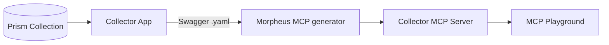

import useBaseUrl from '@docusaurus/useBaseUrl';

# Morpheus Generated MCP Server
We use a  custom Nutanix Prism MCP server generated using Morpheus, which is a  SaaS platform that transforms OpenAPI/Swagger specifications into fully functional MCP servers, allowing developers to expose existing APIs as MCP tools with minimal effort.

Using the Prism API specification, we generated a **Collector MCP server** that exposes infrastructure inventory, health, performance, and capacity metrics as MCP tools.

It is built in two pieces:



## Stage I: Prism Data API

The foundation of the MCP server is a read-only **FastAPI** service built on top of collected Nutanix Prism data stored in SQLite. It exposes infrastructure inventory, health, performance, and capacity information through REST endpoints, along with specialized **chart-ready APIs** designed for visualization workflows.

<div className="img-gallery">
  <figure>
    
    <figcaption>The collected Prism telemetry behind the REST API - here the <code>cluster_historical_perf_stat</code> table (674 rows) in the bundled SQLite database.</figcaption>
  </figure>
</div>

The service automatically generates Swagger documentation at `http://localhost:8000/docs` and publishes an OpenAPI specification at `/openapi.json`, which serves as the input for Morpheus MCP generation.

A bundled sample database allows the API to run out of the box with no additional setup:

```bash
uv run --directory prism-mcp/rest-api python rest_server.py
```

To simplify downstream consumption, metrics are normalized into human-readable units and returned in chart-ready formats, allowing visualization and analytics tools to consume the data directly without additional transformation.

## Stage II: Collector MCP Server

`prism-mcp/mcp-server/` is a **FastMCP** server generated from the Prism Data API's specification using **Morpheus**. The generated server exposes the underlying REST endpoints as MCP tools, allowing any MCP-compatible client to interact with Prism data through a standardized MCP interface.

<div className="img-gallery">
  <figure>
    
    <figcaption>The Morpheus generator - the Collector project's Prism APIs, imported from Swagger, exposed as MCP tools and one click from <code>Generate MCP Server</code>.</figcaption>
  </figure>
</div>

The server provides several MCP tools covering infrastructure discovery, inventory exploration, performance analytics, and chart generation.

- **Discovery:** Health checks, database listing, and metadata retrieval
- **Inventory:** Clusters, hosts, and virtual machines
- **Performance:** CPU, memory, storage, and utilization metrics
- **Visualization:** Chart-ready endpoints for line charts and capacity breakdowns

Each tool can target a specific collected database through an optional `db` parameter. When omitted, the default sample database is used, enabling the MCP server to run and be explored immediately with zero configuration.

This generated MCP server is the primary data source used throughout the MCP Playground demo workflow.
