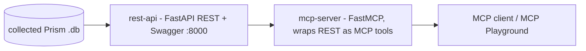

# Prism MCP (custom)

A custom Model Context Protocol server for **Nutanix Prism** data, built for the
MCP Playground. It turns collected Prism data into MCP tools that any MCP client
(including this playground) can call.

It comes in two pieces:



- [`rest-api/`](rest-api/) - a read-only FastAPI service over collected Prism
  SQLite databases (clusters, hosts, VMs, performance, capacity, and chart-ready
  endpoints). Serves Swagger at `http://localhost:8000/docs`.
- [`mcp-server/`](mcp-server/) - a FastMCP server (generated by the Morpheus MCP
  generator) that exposes each REST endpoint as an MCP tool by proxying
  `http://localhost:8000`.

## Why two pieces?

The REST API is what the Morpheus MCP generator consumes (via the OpenAPI spec at
`/openapi.json`) to produce the MCP server. Keeping them split means the same REST
service can power Swagger, the generated MCP, and any other OpenAPI consumer.

## Quickstart (uv)

```bash
# 1) Start the REST API (serves :8000, ships with a sample DB)
uv run --directory rest-api python rest_server.py

# 2) In another shell, start the MCP server (proxies :8000)
uv run --directory mcp-server python server.py
```

In the MCP Playground you normally don't start the MCP server by hand - the
example configs launch it for you via `uv run` (see the repo's `cmd.txt`). You
only need the REST API running.

See each subdirectory's README for details, environment variables, and the full
tool/endpoint list.
